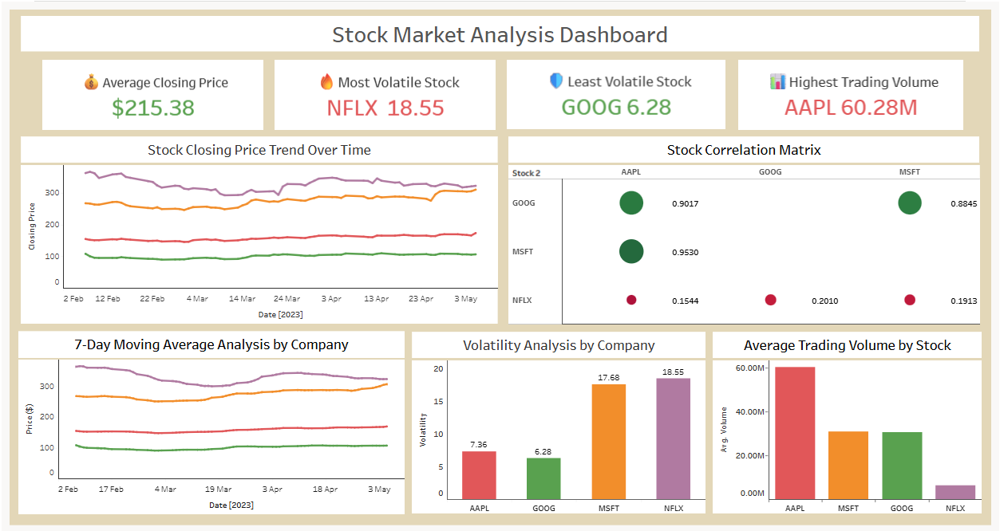

# 📊 Stock Market Analysis Dashboard – Tableau

## 📌 Project Overview
This project analyzes historical stock price data for Apple (AAPL), Microsoft (MSFT), Netflix (NFLX), and Google (GOOG) over a 3-month period (February–May 2023) using Tableau Public.

The objective is to identify trends and patterns in stock price movements, calculate moving averages and volatility, and conduct correlation analysis to examine relationships between different stock prices.

---

## 🎯 Objective
To analyze stock market trends and their potential impact on selected companies (Apple, Microsoft, Netflix, and Google) using historical stock price data.

The objective includes identifying patterns in stock price movements, evaluating volatility, and understanding relationships between different stocks.

---

## 📌 Problem Statement
Given historical stock price data for Apple (AAPL), Microsoft (MSFT), Netflix (NFLX), and Google (GOOG) over a three-month period, the task is to analyze and compare the performance of these companies using data analysis techniques.

The analysis includes:
- Identifying trends and patterns in stock prices
- Calculating moving averages
- Measuring volatility of each stock
- Performing correlation analysis to understand relationships between stocks

---

## 📁 Dataset Information
The dataset contains historical daily stock price records including:
- **Ticker** – Stock symbol (AAPL, MSFT, NFLX, GOOG)
- **Date** – Trading date (Feb 7, 2023 – May 5, 2023)
- **Open** – Opening price
- **High** – Highest price of the day
- **Low** – Lowest price of the day
- **Close** – Closing price
- **Adj Close** – Adjusted closing price
- **Volume** – Number of shares traded

---

## 🛠 Tools & Technologies Used
- **Tableau Public** – Dashboard & Visualizations
- **Microsoft Excel** – Data Cleaning, Pivot Tables & Correlation Calculation
- **CSV** – Raw data format

---

## ⚙️ Data Preparation
The dataset was initially in CSV format and converted into Excel (.xlsx) format for better usability.

No major data cleaning was required as the dataset was already structured.

For correlation analysis:
- Stock data was organized using a Pivot Table
- A separate correlation table was created manually in Excel
- This correlation dataset was then connected to Tableau for visualization

---

## 📊 Dashboard Features & Visualizations

### 🔢 KPI Cards (4 Key Metrics)
| KPI | Value |
|-----|-------|
| 💰 Average Closing Price | $215.38 |
| 🔥 Most Volatile Stock | NFLX 18.55 |
| 🛡️ Least Volatile Stock | GOOG 6.28 |
| 📊 Highest Trading Volume | AAPL 60.28M |

### 📈 Charts
- **Stock Closing Price Trend Over Time** – Line chart showing price movement of all 4 stocks (Feb–May 2023)
- **7-Day Moving Average Analysis** – Smoothed trend lines to identify price direction
- **Volatility Analysis by Company** – Bar chart comparing standard deviation of closing prices
- **Stock Correlation Matrix** – Bubble chart showing correlation strength between all stock pairs
- **Average Trading Volume by Stock** – Bar chart comparing trading activity

---

## 🔍 Key Insights
- 📈 NFLX is the most volatile stock (18.55), indicating higher investment risk
- 📉 GOOG is the least volatile stock (6.28), indicating more price stability
- 💹 AAPL has the highest average trading volume (60.28M shares/day)
- 🔗 AAPL, MSFT & GOOG are highly correlated — they move together (big-tech effect)
- 🎯 NFLX behaves independently from other stocks — useful for portfolio diversification
- 📊 All stocks showed an upward trend during the Feb–May 2023 period

---

## 🚀 Learning Outcomes
- Performed end-to-end data analysis workflow
- Applied Excel for data cleaning and correlation calculations
- Built interactive Tableau dashboard with floating layout
- Conducted correlation and volatility analysis
- Developed analytical storytelling and data visualization skills

---

## 🔗 Live Dashboard
👉 https://public.tableau.com/app/profile/ruksar.musliyar/viz/Stock_Market_Tableau_Final/StockMarketAnalysisDashboard

---

## 🧠 Conclusion
The dashboard provides insights into stock performance using trend analysis, volatility, and correlation. It helps in understanding market behavior and comparing company performance effectively.

---

## 📷 Dashboard Preview

